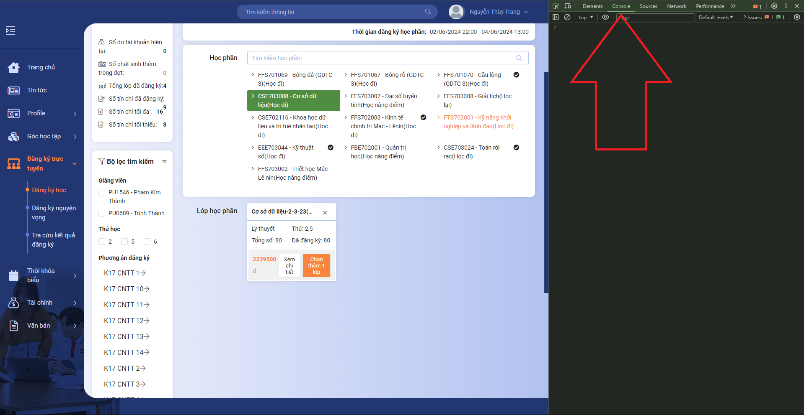
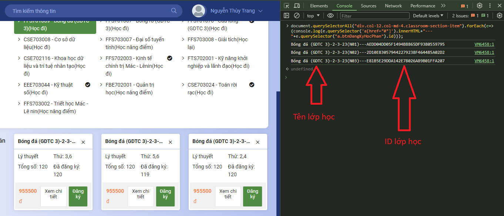
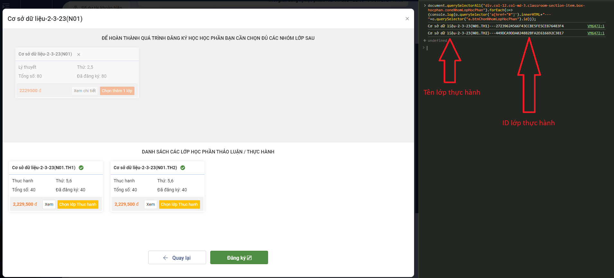

# TOOL LỎ ĐĂNG KÝ HỌC PHẦN PKA
<!-- Nhắc nhở chỉ sài được trên máy tính -->
<p style="color: #ff0000">Trước khi đọc hướng dẫn, bạn cần biết rằng công cụ này chỉ sử dụng được trên máy tính.</p>

## Mục lục
1. [Giới thiệu](#gioi-thieu)
2. [Code](#code)
3. [Hướng dẫn sử dụng](#huong-dan-su-dung)
4. [Lưu ý](#luu-y)

## <p id="gioi-thieu">I. Giới thiệu</p>
Tool lỏ đăng ký học phần PKA là một công cụ giúp sinh viên đăng ký học phần một cách nhanh chóng và tiện lợi. 

## <p id="code">II. Code</p>

### <p style="color: #11ff55">Môn học chỉ lý thuyết</p>
<p id="code_1">Lấy danh sách nhóm lớp học phần</p>

```javascript
document.querySelectorAll("div.col-12.col-md-4.classroom-section-item").forEach(e=>{console.log(e.querySelector('a[href="#"]').innerHTML+"---"+e.querySelector("a.btnDangKyHocPhan").id)});
```
<p id="code_2">Auto đăng ký lớp lý thuyết</p>

```javascript
var id="Nhập ID lớp học phần cần đăng ký vào đây";
var activeTool=1,inter=setInterval(()=>{if(!activeTool){clearInterval(inter);return}document.getElementById(id).click(),document.getElementById("btnDangKyLopHocPhanDaChon").click()},500);
```

### <p style="color: #11ff55">Môn học có nhóm (Lý thuyết + Thực hành)</p>
<p id="code_3">Lấy danh sách lớp thực hành</p>

```javascript
document.querySelectorAll("div.col-12.col-md-3.classroom-section-item.box-hocphan.zoneNhomLopHocPhan").forEach(o=>{console.log(o.querySelector('a[href="#"]').innerHTML+"---"+o.querySelector("a.btnChonNhomLopHocPhan").id)});
```

<p id="code_4">Auto đăng ký nhóm lớp</p>

```javascript
var id_nhom = 'Nhập ID nhóm lớp ở đây';
var id_lop = 'Nhập ID lớp thực hành ở đây';
var activeTool=1,inter=setInterval(()=>{if(!activeTool){clearInterval(inter);return}document.getElementById(id_nhom).click(),document.getElementById(id_lop).click(),document.getElementById("btnDangKyNhomLop").click(),document.getElementById("btnDangKyLopHocPhanDaChon").click()},500);
```

## <p id="huong-dan-su-dung">III.Hướng dẫn sử dụng</p>
1. Mở trang đăng ký học phần của trường.
2. Chọn môn học cần đăng ký.
3. Mở Dev Tool bằng cách nhấn `F12` hoặc `Ctrl + Shift + I` hoặc `Chuột phải -> Inspect (hoặc Kiểm tra)` hoặc `Ctrl + Shift + J`. Sau đó chọn tab `Console`.



4. Copy code [Lấy danh sách nhóm lớp học phần](#code_1) vào console và nhấn `Enter` để lấy ID lớp học phần.

***Nếu báo lỗi như bên dưới thì gõ `allow pasting` và nhấn `Enter` rồi thử lại.***

```javascript
Warning: Don’t paste code into the DevTools Console that you don’t understand or haven’t reviewed yourself. This could allow attackers to steal your identity or take control of your computer. Please type ‘allow pasting’ below and hit Enter to allow pasting.
```



5.1. Nếu môn học chỉ có lý thuyết thì copy code [Auto đăng ký lớp lý thuyết](#code_2) vào console, thay thế ID lớp học phần vào biến `id` và nhấn `Enter` để đăng ký lớp học phần.

Ví dụ:
```javascript
var id="123456789ABCDEFGHIJKLMN";
var activeTool=1,inter=setInterval(()=>{if(!activeTool){clearInterval(inter);return}document.getElementById(id).click(),document.getElementById("btnDangKyLopHocPhanDaChon").click()},500);
```

5.2.1. Nếu môn học có nhóm thì chọn lớp cần đăng ký và chờ đến khi hiện danh sách lớp thực hành. Sau đó, copy code [Lấy danh sách lớp thực hành](#code_3) vào console và nhấn `Enter` để lấy ID lớp thực hành.



5.2.2. Copy code [Auto đăng ký nhóm lớp](#code_4) vào console, thay thế ID nhóm lớp vào biến `id_nhom`, ID lớp thực hành vào biến `id_lop` và nhấn `Enter` để đăng ký nhóm lớp.

Ví dụ:
```javascript
var id_nhom = '123456789ABCDEFGHIJKLMN';
var id_lop = '123456789ABCDEFGHIJKLMN';
var activeTool=1,inter=setInterval(()=>{if(!activeTool){clearInterval(inter);return}document.getElementById(id_nhom).click(),document.getElementById(id_lop).click(),document.getElementById("btnDangKyNhomLop").click(),document.getElementById("btnDangKyLopHocPhanDaChon").click()},500);
```

6. Sau khi đăng ký thành công, bạn sẽ thấy thông báo nhảy lên màn hình liên tục.

### <p id="luu-y" style="color: #ff0000">Lưu ý:</p>
- Tool này chỉ hỗ trợ đăng ký học phần, không sử dụng hay lưu trữ thông tin cá nhân, tài khoản của sinh viên.
- Công cụ này được phát triển với mục đích hỗ trợ sinh viên đăng ký học phần hiệu quả hơn. Tuy nhiên, tôi khuyến khích người dùng sử dụng công cụ một cách có trách nhiệm và cân nhắc kỹ lưỡng trước khi đăng ký để tránh gây ra tình trạng quá tải hệ thống đăng ký học phần của nhà trường, ảnh hưởng đến việc đăng ký của các sinh viên khác. Tôi không chịu trách nhiệm cho bất kỳ tổn hại nào phát sinh do việc sử dụng công cụ này với mục đích trái đạo đức hoặc vi phạm quy định của nhà trường.
- Nếu có bất kỳ vấn đề gì xảy ra, vui lòng liên hệ với tôi qua email: `hoangkhacphuc.dev@gmail.com` hoặc Facebook: [Hoàng Khắc Phúc](https://www.facebook.com/hoangkhacphuc.dev).